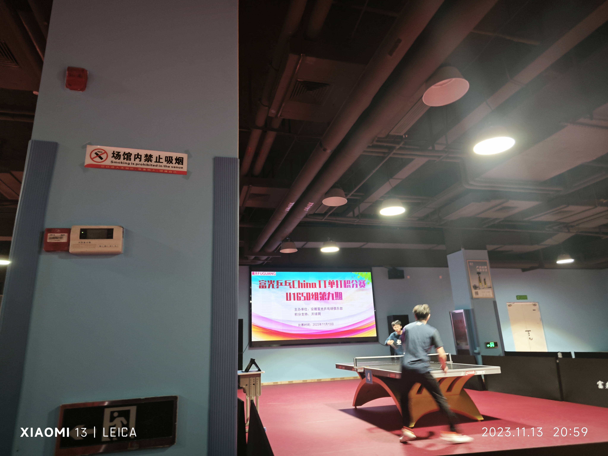
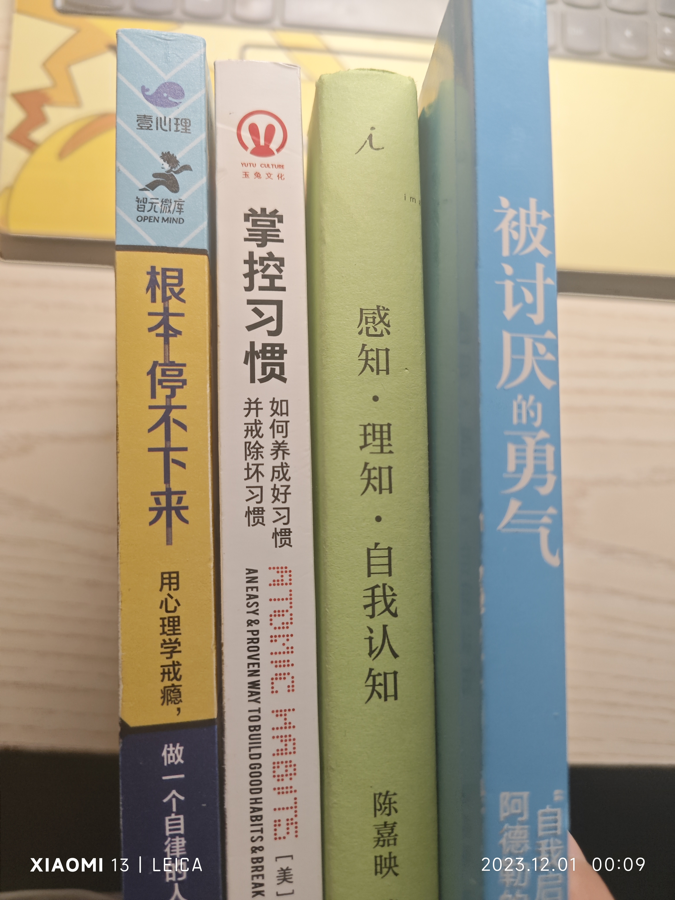

## 行程

4号参加校园苏州日活动，蹭高铁回了苏州

13号回了合肥

28号夜爬大蜀山

## 运动

5号在苏州打了第二场开球网积分赛，小组未出线，1497->1505

6号参加了苏州首届高校校友乒乓球赛，团体赛的形式，未出线，认识了这边的几个校友

13号和茂林师兄去参加了合肥的富光乒乓积分赛，第一次小组出线，打进了八强，1505->1529

26号和华晟、德斌去参加了合肥的盛荣乒乓积分赛，小组出线后淘汰了，掉大分，1529->1517

中间偶尔打羽毛球，和嘉琪。华晟、德斌打羽毛球也很厉害，打不过

## 看书

看完了《根本停不下来——用心理学戒瘾，做一个自律的人》（沈家宏）、《掌控习惯 atomic habits》（詹姆斯 克利尔）、《被讨厌的勇气》（岸见一郎 古贺史健）。

看《感知 理知 自我认知》（陈嘉映）看了一半看不下去了，后面有时间再看吧。

## 学习

根据之前的经验，花了一周多的时间另外投了篇EI，看明年几月份能检索吧

看视频学习写了个C++项目

正在写Java项目的路上...