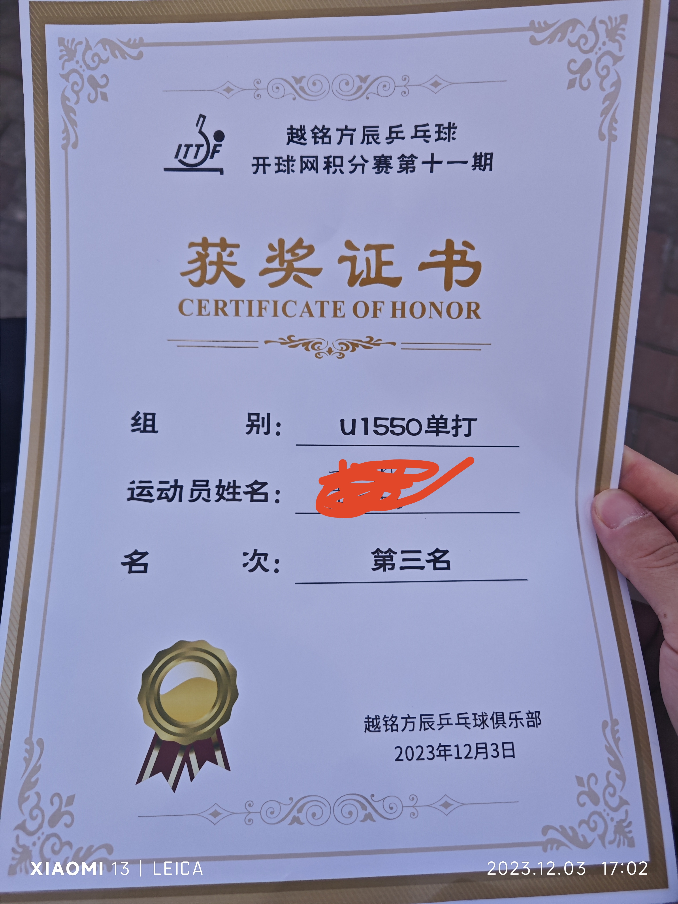
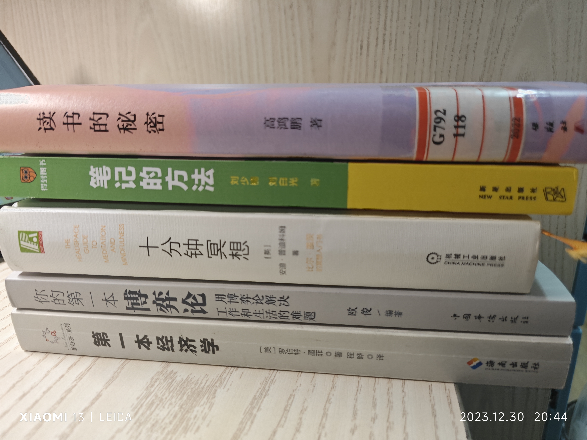

## 行程

10号陪swh回了趟苏州，在苏州躺尸了1周多，18号苏州初雪

19号回了合肥，20号签三方

## 生病

起初是3号在没开空调的那个球馆里打了比赛，4号下午身体就不舒服了，晚上烧到了40多度。
gjq回家了，喊shs和wzy陪我去了安医大附一高新区急诊，到医院12点多，人特别多。等叫号的过程中真快烧麻了，没什么力气，感觉脑袋像呆了紧箍咒一样，一圈一圈地疼。凌晨2点多才输上液，应该是甲流。回宿舍已将近3点，烧慢慢退了。5号起来以为好了，下午洗了澡，晚上又烧了，一直查小红书搜攻略，物理降温、换感冒药吃，幸好后面降温了。后面总计吃了5天甲流特效药，磷酸奥司他韦。后来身体已经恢复了，但高烧引起的神经性耳鸣一直萦绕在耳边，搜了一下感觉治不好这耳鸣了。

已经很久没生病了，这次去了急诊还是感触良多。看见形形色色的病人，才知道健康的可贵。

## 运动

2号和ldb、shs在富光打了积分赛，没出线，被一个小孩哥暴揍（10岁，球龄5年）。

3号和wzy在越铭方辰打了U1550积分赛，拿了季军hhh，差点被另一个小孩哥干掉。

在合肥一直一周打两三次，每次是8点到10点半。

## 看书

- 《第一本经济学》（罗伯特·墨菲）。介绍了经济学常识。

- 《你的第一本博弈论》（欧俊）。介绍了几个博弈论模型。有点后悔看完了，套路是介绍什么博弈模型，然后举一些史实、事例等强行靠上去，豆瓣评分低不是没有理由的。

- 《十分钟冥想》（安迪·普迪科姆）。介绍了冥想和正念，并提供了实践方法。关于正念，保持好奇心，多关心周围。关于冥想，呼吸是最合适的冥想载体。

- 《笔记的方法》（陈少楠、刘白光）。粗略看了看，算是flomo的说明书，介绍了一些做笔记的方法。没必要细看了，有需要再查阅。

- 《读书的秘密》（高鸿鹏）。图书馆借的。推荐了一些高质量书单，有丰富的历史故事、演讲内容、人物讲话等内容引用，阐述了读书过程中作者从选书、读书到悟书等环节的理解，对我有启发。作者反复提及了通过读书向杰出人物学习，为我后续读书指明了方向。但其中有部分内容重复，即一些内容在几个章节反复提及，用不同的话说，某种程度上有啰嗦、水字数的嫌疑。总的来说还是可以的。

- 《底层逻辑》（吕白）。手机上pdf看的。一些论点再加上作者及其身边人经历的事辅以论证，从而构成了所谓的“底层逻辑”。食之无味，弃之可惜。

以后看书得先看豆瓣评分以及书评，需要注重书的内容。除了消遣看的，理应做笔记，有机会实践。 

## 学习

开始写大论文。

## 电影

看了《名侦探柯南：黑铁的鱼影》，中规中矩。

