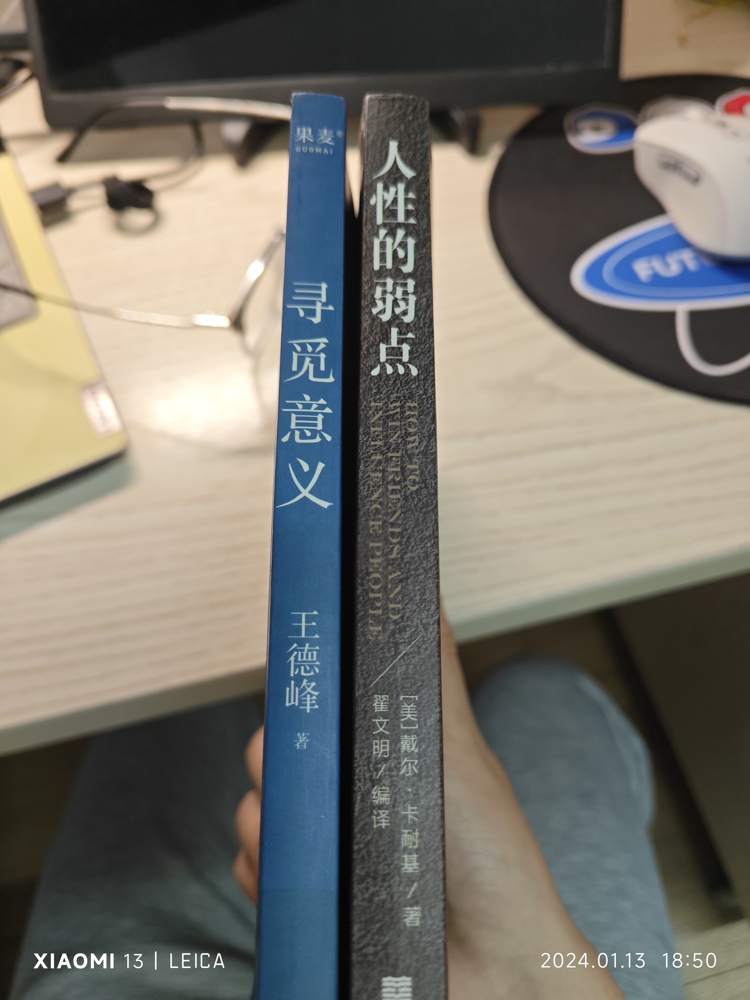

## 行程

5号去了六安，做伴郎，参加xjx师兄的婚礼

17号回湖南，去了衡阳，拔牙

19号去了深圳，在惠州玩了两天，22号晚上又回了衡阳

24号回家

## 旅游

第一次去了深圳，和朋友们自驾去了惠州。

## 生病

月末几天又发烧咳嗽了。。。

## 看书

- 《人性的弱点》（戴尔·卡耐基）。经典，值得常翻。

- 《寻觅意义》（王德峰）。高频出现的几个名词是哲学、艺术、真理。最后给的寻觅意义的建议是“背上一个小小的行囊，去做一些并不起眼的小事情”。

- 《认知突围》（蔡垒磊）。印象深刻的词是格局、时间。手机上看的pdf。聊胜于无。

## 学习

大论文

## 电视

《繁花》

